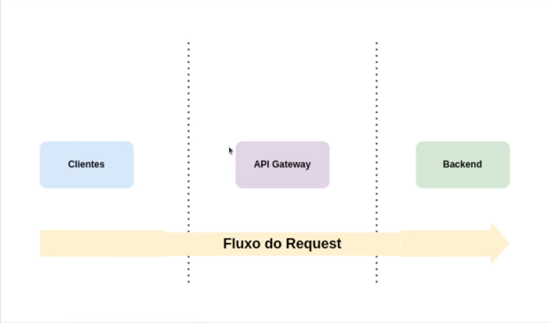

# API Gateway
Imagine que você tem um ecossistema interno onde há 10 microsserviços, cada um contendo seus detalhes de logging, tracing, rate limiting, autenticação entre outros. Cada sistema diferente que fizesse uso de suas APIs haveria de se preocupar com para onde fazer a requisição, rotas diferentes em cada serviço, maneiras diferentes de se autenticar em cada um deles, retornos difrentes e tudo mais; Isso fora o trabalho que seria gerenciar o tracing e todos os detalhes operacionais desses serviços.

Agora, imagina que mágico seria se tivéssemos uma porta de entrada unificada para todas as nossas aplicações? Um lugar comum onde todos os clients de seus serviços concentrariam suas chamadas, com as mesmas características, sem se preocupar com diferentes hosts de serviço, seus inúmeros endpoints, suas características de autenticação diferentes e afins.

Pois bem, essa solução existe, e ela se chama API gateway.

## API Gateway pattern
Em um modelo que implementa um padrão de arquitetura de microsserviços, como os clientes vão poder identificar o serviço que contém as informações que ele necessita? Em geral, a granularidade das informações do microsserviço é diferente da qual gostaríamos de expor para o cliente. A solução para isso se chama API gateway pattern

## O Que é um API Gateway
No dicionarês: É uma ferramenta de gerenciamento, geralmente adicionada entre o cliente e um grupo de sistemas de um determinado contexto, atuando como ponto único de entrada das APIs. Mas na prática, nós veremos nesse artigo como isso funciona

## Funcionalidades de um API Gateway
Geralmente o API gateway atua na camada de rede, prove4ndo funcionalidades ortogonais, as que não necessariamente são responsabilidade das aplicações.

### Quais são essas funcionalidades
- Rate limiting
- Autenticação padronizada
- Controle de logs
- Routing
- Padronização de métricas
- Tracing distribuído

## Tipos de API gateway
### Enterprise gateway (para times em silos)
O foco deste tipo de solução é na grande maioria das vezes realizar exposição e gerenciamento de deployment de APIs voltadas ao negócio, em geral ele também permite controlar o lifecycle de uma API.

Em geral é uma oferta de album vendor com estratégias comerciais suportando a solução. Este também tende a direcionar a aplicação da solução e implicar no design dos seus serviços.

#### Propósito principal
Exposição, composição e gerenciamento de APIs externas/internas.

#### Manutenção das APIs
Time de APIs em geral faz administração via portal do API gateway.

#### Suporte a ambientes
Suporta múltiplos ambientes, DEV, QA e PROD.

Pode ser utilizado para uma modernização da arquitetura aplicando padrões como façade ou strangler application (deve ser o meio, e não o final da solução). Porém uma atenção que devemos ter é a de disponibilidade x consistência, policies e afins.

Em geral, enterprise gateways precisam de dependências externas como bancos de dados, cache entre outros, portanto CUIDADO, isso pode aumentar suas chances de indisponibilidade. A mobilidade do deployment é bem baixa, pois enterprise gateway são EDGE na maioria dos casos.

### Microservices gateway (para times multidisciplinares)
Tipicamente essa classe de gateways tem a capacidade de "rotear" tráfego de entrada para APIs ou serviços. Em geral não oferecem suporte ao lifecycle das APIs e as quepies tem que fazê-lo via processo separado. A maioria é open source.

Geralmente não possuem dependência externa, e são componentes standalone, o que faz com que a plataforma (k8s) gerencie o estado necessário para a execução da aplicação

#### Propósito principal
Exposição, observabilidade e monitoramento dos serviços.

#### Manutenção das APIs
Time de API ou time de criação/manutenção do serviço via configuração declarativa fazem atualizações, esta tarefa faz parte do deployment dos serviços.

#### Suporte a ambientes
A instância controla um único ambiente, possui suporte a roteamento mais dinâmico como por exemplo um canary para facilitar o debugging.

Algumas dicas são: Reduza o número de instâncias para ganhar experiência na gestão do ambiente para escalar para toda companhia. Use a flexibilidade do deployment para "particionar" suas APIs (use bounded context do DDD), e tente ser steateless o máximo possível. Isso vai aumentar muito a facilidade de escalabilidade/disponibilidade.

Números de instâncias podem ser um problema em equipes sem expertise em monitoramento e observabilidade. A granularidade fina demais pode complicar a manutenção das APIs. Portanto, a automação deve ser pensada desde o início da jornada.

## Vantagens e desvantagens
### Vantagens
- Padronização de algumas features ortogonais como logging e segurança.
- Ajuda na governança de rede da companhia.
- Ponto único de entrada na rede, facilita o gerenciamento.
- Ferramenta essencial para a adoção de uma estratégia de APIs.

### Desvantagens
- Adiciona complexidade na sua arquitetura.
- Disponibilidade, precisa de cuidado extra.
- Precisa de manutenção/atualização recorrentes.