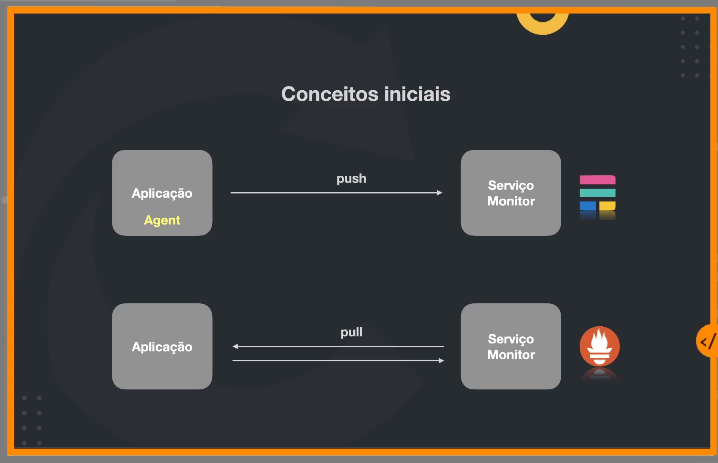

# Prometheus
- Prometheus é um toolkit de monitoramento e alerta de sistema open source
- Criado pela sound cloud
- Faz parte da CNCF (Cloud native computing foundation)
- Captura dados dimensionais (consulta através de histogramas envés de métricas isoladas)
- Consultas poderosas
- Fácil visualização dos dados em conjunto com Grafana
- Storage eficiente
- Simples
- Alerta inteligente
- Diversidade de clients e integrações

## Conceitos iniciais
Diferente do Elastic stack, o prometheus trabalha através de um pull HTTP na aplicação, envés de a aplicação fazer push para o motor de observabilidade.

Nós expomos um endpoint /metrics na nossa aplicação  adaptado ao formato do Prometheus

O prometheus por sua vez, é um servidor HTTP que interagirá com nossa aplicação. Ele possui um TSDB (time series data base) que é o componente que faz o armazenamento das informações das nossas aplicações em formato de time series, permitindo que ele seja muito rápido. Ele também possui um componente de retrieval que é o responsável por armazenar nossas métricas nesse banco de dados.

O prometheus também tem um mecanismo de service discovery, responsável por saber todos os pods que estão escalando nas suas aplicações

## Push gateway
O prometheus possui um mecanismo de push gateway, onde quando sua aplicação não precisa ser consultada ("pullada") a cada 15 segundos devido à baixa demanda ou processamento, você mesmo pode orquestrar seus pushs das métricas para o servidor do prometheus.

## Alert-manager
Você pode plugar um alert manager ao seu prometheus, que ao perceber uma instabilidade definida nas suas métricas, disparará um alerta

## Exporters
Exporters nos permitem pegar métricas de aplicações externars/que não temos controle, como um servidor linux, um MySQL entre outros, expondo um servidor web com um endpoint /metrics que será "pullado" pelo prometheus. 

## Armazenamento
- TSDB
- Armazenamento de dados que mudam conforme o tempo
- Labels para propriedades específicas de uma determinada métrica (error_type=500)
- Otimização específica para esse caso de uso, garantindo mais performance do que bancos de dados convencionais
- Quanto mais novos os dados, mais precisão 

## Métricas
- Counter
    - Valor incremental
- Gauge
    - Valor pode possuir variações com o tempo
    - Aumentar/diminuir/estabilizar
    - Exemplos: Quantidade de usuarios online, servidores ativos
- Histogram
    - Distribuição de frequência
    - Medição é baseado em amostras (sampling)
    - Consegue agregar valores
- Summary
    - Muito similar ao histogram
    - Com summary os valores são calculados no servidor de aplicação e não no prometheus

## PromQL
- Prometheus Query Langague (SQL do prometheus)
- Exemplo:
    - http_requests_total (Estou armazenando)
    - rate(http_requests_total[5m])
    - http_requests_total{status!~"4..."}